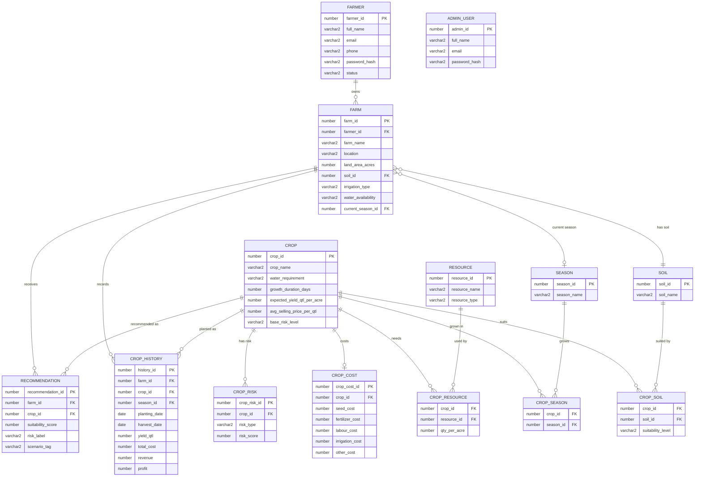

# KrishiMitra 🌾
**Better Decisions. Better Harvests.**

KrishiMitra is a data-driven Farmer & Crop Management **Decision Support System** built on Oracle Database. It goes beyond a simple farm-records CRUD app: at its core is a transparent, rule-based **Smart Recommendation Engine**, a **What-If Crop Simulator**, a **Farming Economics calculator**, and a **Crop Risk Analyzer** — all backed by a properly normalized Oracle schema with views, functions, procedures, and triggers.

---

## 1. Features

**Farmer**
- Secure registration & login (bcrypt password hashing, session auth)
- Farm management (add / edit / delete, soil, irrigation, water availability, season)
- Crop library with full crop details (soil/season fit, cost, risk, resources)
- Smart Crop Recommendation Engine with a ranked, scored list and a **"Why this crop?"** explanation for every result
- What-If Simulator — change land, budget, water, irrigation, soil or season and instantly see how the rankings shift
- Farming Economics calculator (investment, revenue, profit, ROI)
- Crop Risk Analysis (Krishi Risk Score, per-factor breakdown, advice)
- Crop history log used for crop-rotation scoring and profit analytics
- Personal dashboard with stats, charts, and quick actions

**Admin**
- Separate login & dashboard
- Manage farmers (view, block/unblock)
- View all farms
- Full crop CRUD, plus crop-soil / crop-season compatibility, crop costing and crop risk factor management
- Manage soil types and seasons
- View every recommendation ever generated
- System-wide statistics (total farmers/farms/crops/recommendations, most cultivated & most recommended crop, average farm size)

---

## 2. Architecture

```
Frontend (HTML5 / CSS3 / JS / Chart.js)
        ↓
Flask Backend (Blueprints, Jinja templates)
        ↓
Business Logic (services/recommendation_engine.py, economics.py, risk_engine.py)
        ↓
Oracle Database (tables, views, functions, procedures, triggers)
```

- **Frontend**: server-rendered Jinja templates styled with a custom design system (no default Bootstrap look), Chart.js for dashboard charts, Font Awesome icons.
- **Backend**: Flask, organized as blueprints (`auth`, `farmer`, `crops`, `recommendation`, `economics`, `risk`, `admin`), talking to Oracle exclusively through parameterized queries in `db/connection.py`.
- **Business logic**: the recommendation, economics and risk engines are implemented as Python services **and** mirrored as Oracle PL/SQL functions/procedures (`CALCULATE_CROP_SCORE`, `CALCULATE_PROFIT`, `CALCULATE_RISK_SCORE`, `GENERATE_RECOMMENDATIONS`) so the scoring logic can be demonstrated and verified directly from SQL*Plus as well as through the web app.
- **Database**: Oracle, fully normalized to 3NF (see §5).

---

## 3. ER Diagram (Mermaid)



---

## 4. Database Schema Summary

| Table | Purpose |
|---|---|
| `FARMER` | Farmer accounts (auth + profile) |
| `ADMIN_USER` | Admin accounts, separate identity space from farmers |
| `FARM` | A farmer's individual land parcel and its conditions |
| `SOIL` | Master list of soil types |
| `SEASON` | Master list of cropping seasons |
| `CROP` | Master crop catalogue (intrinsic facts only) |
| `CROP_SOIL` | M:N — which soils suit which crops, and how well |
| `CROP_SEASON` | M:N — which seasons a crop is grown in |
| `CROP_COST` | Per-acre standard cost breakdown for a crop |
| `RESOURCE` | Master list of inputs (seed, fertilizer, labour, equipment) |
| `CROP_RESOURCE` | M:N — which resources a crop typically needs |
| `CROP_RISK` | Per-crop, per-risk-type score (water/soil/disease/market/weather) |
| `CROP_HISTORY` | A farmer's actual planting records, used for rotation & analytics |
| `RECOMMENDATION` | Saved snapshots of engine runs (audit trail + "why") |

**Why split this way?** Soil, season and resource facts are stored exactly once each and referenced through junction tables, rather than being repeated as free-text columns on every crop. Risk is stored as one row per risk type instead of five separate risk columns, avoiding a repeating group. This is what keeps the design in 3NF (see below) and lets the recommendation engine query real relational data instead of parsing text.

---

## 5. Normalization

**Unnormalized (hypothetical starting point):** a single `CROP_INFO` table with columns like `suitable_soils = "Red, Sandy"`, `suitable_seasons = "Kharif, Zaid"`, `risk_water=70, risk_soil=20, risk_disease=30, ...` — repeating groups and comma-separated multi-values.

**1NF:** Split repeating/multi-valued groups into atomic values — one soil per row, one season per row, one risk type per row. This produces `CROP_SOIL`, `CROP_SEASON`, `CROP_RISK` as separate tables with atomic attributes.

**2NF:** Every non-key attribute must depend on the *whole* key. In `CROP_SOIL(crop_id, soil_id, suitability_level)`, `suitability_level` depends on the combination of both crop and soil (not on either alone), satisfying 2NF. Cost and resource-quantity attributes were similarly checked against their composite keys.

**3NF:** No transitive dependencies. For example, `AVG_SELLING_PRICE_PER_QTL` depends only on `CROP_ID`, not on any other non-key column, so it stays on `CROP` rather than being duplicated into `CROP_HISTORY` (which instead stores the *actual* realized revenue for that specific planting, a genuinely different fact). `FARM.SOIL_ID` references `SOIL` rather than storing the soil description directly on `FARM`, eliminating the transitive dependency `FARM → SOIL_ID → SOIL_NAME`.

The final schema (`database/schema.sql`) satisfies 3NF: every table's non-key attributes depend on the whole primary key and nothing but the key.

---

## 6. Oracle DBMS Concepts Demonstrated

| Concept | Where |
|---|---|
| Primary / Foreign keys, UNIQUE, NOT NULL, CHECK, DEFAULT | Every table in `schema.sql` |
| Sequences | `SEQ_FARMER_ID`, `SEQ_FARM_ID`, ... one per table |
| Indexes | `IDX_FARMER_EMAIL`, `IDX_FARM_FARMER`, `IDX_CH_FARM`, etc. |
| Views | `FARMER_FARM_SUMMARY`, `CROP_PERFORMANCE_VIEW`, `ADMIN_CROP_STATISTICS`, `CROP_RISK_OVERVIEW` |
| Stored Functions | `CALCULATE_CROP_SCORE`, `CALCULATE_PROFIT`, `CALCULATE_RISK_SCORE` |
| Stored Procedures | `ADD_FARM`, `GENERATE_RECOMMENDATIONS`, `RECORD_HARVEST` |
| Triggers | Auto-timestamps (`TRG_FARMER_UPDATED_AT` etc.), profit auto-calculation (`TRG_CROP_HISTORY_PROFIT`), invalid-state guards (`TRG_BLOCK_FARM_FOR_INACTIVE`), date validation (`TRG_HISTORY_DATE_CHECK`) |
| Transactions (COMMIT/ROLLBACK) | Every procedure in `procedures.sql`; `services/recommendation_engine.py:persist_recommendations` |
| Joins, aggregates, subqueries | Views, `ADMIN_CROP_STATISTICS` (correlated subqueries for "most cultivated/recommended crop") |

---

## 7. Project Folder Structure

```
krishimitra/
├── app.py                     # Flask app factory & entrypoint
├── config.py                  # Env-driven configuration
├── requirements.txt
├── .env.example
├── database/
│   ├── schema.sql              # Tables, constraints, sequences, indexes
│   ├── seed.sql                 # Master + sample data
│   ├── views.sql
│   ├── functions.sql
│   ├── procedures.sql
│   └── triggers.sql
├── routes/                     # Flask blueprints
│   ├── auth.py  farmer.py  crops.py  recommendation.py
│   ├── economics.py  risk.py  admin.py  main.py
├── services/                   # Business logic
│   ├── recommendation_engine.py
│   ├── economics.py
│   ├── risk_engine.py
│   └── auth_service.py
├── db/
│   └── connection.py            # Oracle pool + parameterized query helpers
├── templates/                   # Jinja templates (see below)
├── static/
│   ├── css/style.css
│   └── js/{main,auth,forms,charts}.js
└── tests/
    └── test_app.py
```

---

## 8. Oracle Setup

1. Install Oracle Database (Express Edition 21c/23c is enough) or use an existing Oracle instance.
2. Create a dedicated user/schema:
   ```sql
   CREATE USER krishimitra IDENTIFIED BY "YourPassword123";
   GRANT CONNECT, RESOURCE, CREATE VIEW, CREATE SEQUENCE, CREATE PROCEDURE, CREATE TRIGGER TO krishimitra;
   ALTER USER krishimitra QUOTA UNLIMITED ON USERS;
   ```
3. Connect as `krishimitra` (e.g. via SQL*Plus or SQL Developer) and run the scripts **in this exact order**:
   ```sql
   @database/schema.sql
   @database/seed.sql
   @database/views.sql
   @database/functions.sql
   @database/procedures.sql
   @database/triggers.sql
   ```
4. Note your connection details (host, port, service name — e.g. `XEPDB1` for XE) for the `.env` file below.

---

## 9. Python Setup

```bash
git clone <your-repo-url> krishimitra
cd krishimitra
python -m venv venv
source venv/bin/activate        # Windows: venv\Scripts\activate
pip install -r requirements.txt
cp .env.example .env
# edit .env with your Oracle credentials
```

`.env` variables:
```
FLASK_SECRET_KEY=some-long-random-string
ORACLE_USER=krishimitra
ORACLE_PASSWORD=YourPassword123
ORACLE_HOST=localhost
ORACLE_PORT=1521
ORACLE_SERVICE=XEPDB1
ORACLE_CONNECTION_MODE=thin
```

## 10. Running the App

```bash
python app.py
```
Visit **http://localhost:5000**.

---

## 11. Sample Login Credentials

| Role | Email | Password |
|---|---|---|
| Admin | `admin@krishimitra.in` | `Admin@123` |
| Farmer (demo) | `ramesh.kumar@example.com` | `Farmer@123` |

Both hashes in `seed.sql` are real bcrypt hashes for the passwords above — you can log in immediately after loading `seed.sql`, no extra step required.

---

## 12. How Recommendation Scoring Works

For every active crop, the engine computes a 0–100 suitability score:

| Factor | Points | Logic |
|---|---|---|
| Soil compatibility | 25 | Looked up from `CROP_SOIL.SUITABILITY_LEVEL` (Excellent=25, Good=20, Fair=12, Poor=5) |
| Season compatibility | 20 | Full points if the crop is grown in the farm's current season (`CROP_SEASON`) |
| Water compatibility | 20 | Crop's water requirement vs farm's water availability (exact match = full score; graded partial credit otherwise) |
| Budget compatibility | 15 | Farmer's budget vs the crop's estimated total cost for their land area (`CROP_COST`) |
| Crop rotation / history | 10 | Penalizes repeating the exact same crop as the farmer's last planting |
| Resource compatibility | 10 | Fewer distinct required resources scores slightly higher |

Every recommendation stores (and the UI shows) the **explanation bullets** behind the score — the system never says "recommended" without justifying why. The same weighting model is implemented twice: once in Python (`services/recommendation_engine.py`, used by the live UI and the What-If Simulator) and once in PL/SQL (`CALCULATE_CROP_SCORE` in `database/functions.sql`, callable directly from SQL for verification/demo purposes).

---

## 13. Screens / Pages

Landing → Register → Login → Farmer Dashboard → My Farms (add/edit/delete) → Crop Library → Crop Detail → Smart Recommendation ("Why this crop?") → What-If Simulator → Economics Calculator → Risk Analysis → Crop History → Profile → Admin Login → Admin Dashboard → Admin: Farmers / Farms / Crops / Compatibility / Soils / Seasons / Recommendations.

---

## 14. Testing

Run the automated test suite:
```bash
pytest tests/test_app.py -v
```
Covers: password hashing/validation, the scoring matrices, economics calculations (profit/loss scenarios), risk-weight normalization, and Flask route smoke tests (landing/register/login load; dashboard and admin routes redirect when logged out; a farmer cannot access another farmer's farm — 403).

**Manual test checklist:**
- [ ] Register with a duplicate email → rejected with a clear message
- [ ] Register with a weak password → rejected, lists missing requirements
- [ ] Login with wrong password → "Invalid email or password"
- [ ] Add a farm with land area = 0 → rejected
- [ ] Generate a recommendation → ranked list + "Why this crop?" bullets appear
- [ ] Run the What-If Simulator, change water availability from High to Low → rankings visibly reorder
- [ ] Economics calculator with a very high seed cost → shows a loss / negative ROI
- [ ] Log in as a second farmer and try to open the first farmer's `/farms/<id>/edit` URL directly → 403
- [ ] Block a farmer from the admin panel → that farmer can no longer log in
- [ ] Deactivate a crop from admin → it disappears from the farmer's crop library and recommendations

---

## 15. Future Improvements
- Weather API integration for live, location-based weather risk
- SMS/WhatsApp alerts for recommended sowing windows
- Mandi price API integration for live market-risk scoring
- Multi-language UI (Hindi, Kannada, etc.)
- Mobile app wrapper

---

## 16. DBMS Viva Questions & Answers

**Q1. Why did you separate CROP_SOIL and CROP_SEASON instead of storing suitable soils/seasons as text columns on CROP?**
A: Storing them as comma-separated text would violate 1NF (multi-valued attribute) and make querying ("find all crops suited to Red soil") require string parsing instead of a simple join. Junction tables let a soil or season be shared cleanly across many crops with no duplication.

**Q2. Why is CROP_RISK one row per risk type instead of five columns on CROP?**
A: Five fixed risk columns would be a repeating group and make it hard to add a new risk type later without an ALTER TABLE. One row per `(crop_id, risk_type)` is more flexible and still fully queryable via `MAX(CASE WHEN ...)` pivots (see `CROP_RISK_OVERVIEW` view).

**Q3. What does GENERATE_RECOMMENDATIONS demonstrate?**
A: A multi-statement transaction (DELETE old scenario rows, INSERT new scored rows, COMMIT together) plus a REF CURSOR returned to the caller — showing procedural SQL beyond single-statement DML.

**Q4. How do you prevent a farmer from viewing another farmer's farm?**
A: Every farm/history query is filtered by `FARMER_ID = session['farmer_id']` at the SQL level (not just hidden in the UI), and route handlers explicitly verify ownership before any edit/delete, returning 403 otherwise.

**Q5. Where do you use a trigger to enforce a business rule beyond a simple CHECK constraint?**
A: `TRG_BLOCK_FARM_FOR_INACTIVE` prevents inserting a FARM row for a farmer whose account has been administratively blocked — a cross-table rule a column-level CHECK constraint cannot express.

**Q6. How is profit kept consistent if a record is corrected later?**
A: `TRG_CROP_HISTORY_PROFIT` recomputes `PROFIT = REVENUE - TOTAL_COST` automatically on any insert/update of those columns, so profit can never silently drift out of sync with its inputs.

**Q7. Why calculate the crop score in Python and not only in PL/SQL?**
A: The What-If Simulator needs to re-score every crop against many hypothetical scenarios interactively, ideally without a database round trip per keystroke. The Python engine mirrors the PL/SQL function exactly so both can be demonstrated and cross-checked, but the simulator's fast path uses Python.

**Q8. How are passwords protected?**
A: Bcrypt with a 12-round salt (`services/auth_service.hash_password`); the database only ever stores the hash, never the plaintext password.

**Q9. How do you prevent SQL injection?**
A: Every query goes through bind parameters (`:name` placeholders via `oracledb`), never string concatenation of user input into SQL.

**Q10. What's the difference between the `CURRENT` and `WHAT_IF` scenario tags in RECOMMENDATION?**
A: `CURRENT` stores the farmer's live recommendation for their actual farm conditions; `WHAT_IF` stores a saved hypothetical scenario from the simulator, so both can coexist and be compared without overwriting each other.

---

## 17. Demo / Presentation Script (Engineer's Day)

1. **Hook (30s):** "Every farmer makes a multi-lakh-rupee bet on which crop to plant, usually on intuition. KrishiMitra turns that decision into data."
2. Open the landing page, walk through the tagline and feature cards.
3. Register a new farmer live, log in.
4. Add a farm (Red soil, Borewell irrigation, Moderate water, Kharif season).
5. Open **Smart Recommendation** — show the ranked list and click "Why this crop?" for the top result.
6. Open the **What-If Simulator** — switch water availability from Moderate to Low, click "Analyze Scenario," and narrate how a drought-hardy crop like Ragi or Bajra jumps up the ranking while Rice drops.
7. Open **Economics** for the top crop — show investment/revenue/profit/ROI.
8. Open **Risk Analysis** — show the Krishi Risk Score gauge and the advisory message.
9. Add a **Crop History** entry, show it reflected on the dashboard.
10. Log out, log in as **Admin** — show the system statistics dashboard, then deactivate a crop and show it disappear from the farmer's recommendation list.
11. **Close:** "This isn't just a records database — it's a transparent, explainable decision-support engine built entirely on Oracle SQL and PL/SQL."

---

## 18. Why KrishiMitra Is Innovative

1. **Explainable, not a black box** — every recommendation ships with the exact point breakdown behind it, unlike opaque "AI recommends X" tools.
2. **What-If Simulator** — turns the recommendation engine into an interactive planning tool, not a one-shot report.
3. **No external AI dependency** — the entire decision engine runs on transparent, auditable SQL/PL-SQL logic that a student (or a skeptical farmer) can fully inspect.
4. **Decision support, not just record-keeping** — economics and risk modules turn raw agricultural data into an actual go/no-go business case per crop.
5. **Database-first engineering** — the scoring/profit/risk logic is implemented natively in Oracle (functions, procedures, triggers) as well as in the app layer, so the system remains correct and demonstrable even querying Oracle directly, independent of the web UI.
